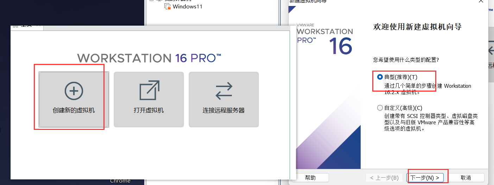

# centos_jira搭建

```
Created on  May 13 14:15:10 2024

@author: amory
@address : 
```

vm,网卡,换源,如果是云服务器就不用

# 阐述一下我遇到的比较难问题

```python
#虚拟机的网络,无法ping外网
1.三种网络设置,电脑里面的为虚拟机的网打开,和虚拟机的设置开关
#浏览器打不开网页
防火墙
```


# VM搭建centos


###



#####


####


###


内存,CPU配置,看自己电脑


进入后,回车

alt可以释放鼠标


###


###什么都不用动,点完成就好


##


###


###设置好密码后,完成配置就好  然后 重启


# 网卡,Yum换源

一开始就一个网卡,本地的

无法ping外网


静态ip配置

```python
新建网卡  echo ONBOOT=yes >> /etc/sysconfig/network-scripts/ifcfg-ens33

```


编辑网卡 

```python
vi ifcfg-ens33
下面是我的网卡
```


重启一下!!!!

尝试ping外网


#######网卡的配置很麻烦,小问题很多,有三种模式,

# 换源

**备份现有的 `yum` 源**

```python
sudo cp -r /etc/yum.repos.d /etc/yum.repos.d.backup
```

下载新的 `yum` 源配置文件**

```python
wget -O /etc/yum.repos.d/CentOS-Base.repo http://mirrors.aliyun.com/repo/Centos-7.repo
```

如果报错:


**安装 wget**：首先，确保 `wget` 工具已经安装在你的系统上。你可以使用 `yum` 命令来安装它

```python
yum install -y wget
```


重新尝试下载


**清除缓存**

```python
sudo yum clean all 
sudo yum makecache
```


**恢复原有源（如果需要）**

如果新的源不工作，你可以使用之前备份的文件夹来恢复原有源。

```python
sudo rm -rf /etc/yum.repos.d/* 
sudo cp -r /etc/yum.repos.d.backup/* /etc/yum.repos.d/ 
sudo yum clean all 
sudo yum makecache
```

# 开始正式

## 1

```python
rpm -Uvh http://dev.mysql.com/get/mysql-community-release-el7-5.noarch.rpm
```


```python
这个命令是用来在 CentOS 7 或者 RHEL 7 系统上安装 MySQL 社区版的软件源配置文件。具体来说：

rpm 是 Red Hat Package Manager 的缩写，用于在基于 RPM 包管理的 Linux 系统上安装、更新、卸载软件包。
-Uvh 是 rpm 命令的参数：
-U 表示更新已经安装的包，或者如果包不存在则安装它。
-v 表示显示详细的输出，可以看到安装过程中的进度和详细信息。
-h 表示在显示进度条时以哈希符号 (#) 作为进度的标记。
http://dev.mysql.com/get/mysql-community-release-el7-5.noarch.rpm 是一个 URL 地址，指向 MySQL 社区版的软件源配置文件 mysql-community-release-el7-5.noarch.rpm。
因此，这个命令的含义是使用 rpm 命令从指定的 URL 下载 MySQL 社区版的软件源配置文件，并将其安装到 CentOS 7 或 RHEL 7 系统中。
```

## 2

```python
yum -y install mysql-community-release-el7-5.noarch.rpm
```


```python
这个命令是使用 yum 包管理器在 CentOS 7 或 RHEL 7 系统上安装 MySQL 社区版的软件源配置文件 mysql-community-release-el7-5.noarch.rpm。让我来解释一下：

yum 是 CentOS 和 RHEL 等基于 RPM 包管理的 Linux 发行版中的包管理器，它可以自动解决依赖关系并安装、更新、删除软件包。
-y 是一个选项，它在执行命令时会自动回答 "yes"，以避免在提示时需要手动输入确认，这在脚本中很常见。
install 是 yum 命令的一个子命令，用于安装软件包。
mysql-community-release-el7-5.noarch.rpm 是软件包的文件名，它是 MySQL 社区版的软件源配置文件。这个命令会安装这个配置文件，使得系统可以通过 yum 安装 MySQL 社区版。
综合起来，这个命令的作用是在系统中安装 MySQL 社区版的软件源配置文件，为之后通过 yum 安装 MySQL 提供必要的软件源支持。
```

## 3

```python
yum repolist enabled | grep "mysql.*-community.*"
```


```python
这个命令是用来列出已启用的软件源中包含 "mysql-community" 的部分。让我解释一下：

yum repolist enabled 用于列出已启用的软件源，并显示它们中包含的软件包信息。
| 是管道符号，用于将一个命令的输出传递给另一个命令。
grep "mysql.*-community.*" 是一个过滤器，它使用 grep 工具来筛选包含 "mysql-community" 字符串的行。
综合起来，这个命令的作用是从已启用的软件源列表中找出其中包含 "mysql-community" 的部分。
```

## 4

```python
yum -y install mysql-community-server
```


```python
这个命令用于在 CentOS 或者 RHEL 系统上安装 MySQL 社区版的服务器软件包。让我解释一下：

yum 是 CentOS 和 RHEL 等 Linux 发行版中的一个包管理器，用于安装、更新、删除软件包等操作。
-y 是一个选项，表示在执行命令时自动回答 "yes"，以避免在提示时需要手动输入确认，这在脚本中很常见。
install 是 yum 命令的一个子命令，用于安装软件包。
mysql-community-server 是要安装的软件包的名称，表示 MySQL 社区版的服务器部分。
综合来看，这个命令的作用是在系统中安装 MySQL 社区版的服务器软件包，它包含了 MySQL 数据库服务器所需的一切。
```

## 5

```python
systemctl enable mysqld

systemctl start mysqld

systemctl status mysqld

```

```python
这三个命令是针对 MySQL 服务的管理。让我来解释一下：

systemctl enable mysqld：

systemctl 是用于管理系统服务的命令。
enable 参数用于启用服务，使其在系统启动时自动启动。
mysqld 是 MySQL 服务的服务单元名称。在大多数情况下，MySQL 服务的服务单元名称是 mysqld。
systemctl start mysqld：

start 参数用于启动服务。一旦服务已经启动，它就可以响应来自客户端的请求。
mysqld 是 MySQL 服务的服务单元名称。
systemctl status mysqld：

status 参数用于显示服务的状态，包括是否正在运行以及相关的详细信息。
mysqld 是 MySQL 服务的服务单元名称。
综合起来，这三个命令的意思是：启用 MySQL 服务，使其在系统启动时自动启动；启动 MySQL 服务以使其运行；以及检查 MySQL 服务的当前状态。
```


## 6

```python
mysql -uroot -p
```

第一连接直接回车


## 7

```python
use mysql;

UPDATE user SET password = PASSWORD('root') WHERE user = 'root' AND host = 'localhost';

flush privileges;
```

```python
这三个命令用于更改 MySQL 数据库中的用户密码。让我解释一下：

use mysql;：

这个命令用于切换当前的数据库上下文到 "mysql" 数据库。在 MySQL 中，"mysql" 数据库包含了用户权限和其他系统级别的信息。
UPDATE user SET password = PASSWORD('root') WHERE user = 'root' AND host = 'localhost';：

这个命令用于更新 "mysql" 数据库中的 "user" 表，将 "root" 用户的密码修改为 "root"。请注意，此处的 'root' 是用户名，而第二个 'root' 是密码，你可以根据实际情况将密码替换为你想要的内容。
user 是 "user" 表中的用户名列，password 是密码列，host 是主机列。
WHERE user = 'root' AND host = 'localhost' 是一个条件，它限定了只有用户名为 'root' 且主机为 'localhost' 的用户才会被更新密码。
flush privileges;：

这个命令用于刷新 MySQL 的权限表，使修改后的用户密码立即生效。
综合起来，这三个命令的作用是切换当前数据库上下文到 "mysql"，然后更新 "mysql" 数据库中 "user" 表中 "root" 用户的密码为 "root"，最后刷新权限表以使修改生效。
```


## 8

```python
GRANT ALL PRIVILEGES ON *.* TO 'root'@'%' IDENTIFIED BY 'root' WITH GRANT OPTION;
```

```python
这个命令用于向 MySQL 数据库中的用户授予所有权限，并且允许该用户通过任何主机（'%' 表示所有主机）连接到 MySQL 服务器。让我来解释一下：

GRANT ALL PRIVILEGES ON *.*：

这个命令用于授予用户对所有数据库和所有表的所有权限。通配符 *.* 意味着所有的数据库和表。
ALL PRIVILEGES 表示授予用户所有权限，包括 SELECT、INSERT、UPDATE、DELETE、CREATE、DROP、INDEX、ALTER 和其他权限。
TO 'root'@'%'：

这个命令指定了授予权限的用户和主机。'root' 是用户名，'%' 表示允许该用户从任何主机连接。
IDENTIFIED BY '712Lsk1314@'：

这个命令设置了用户的密码为 '712Lsk1314@'。
WITH GRANT OPTION：

这个选项允许用户将他们拥有的权限授予给其他用户。也就是说，被授权用户可以使用 GRANT 命令授予权限给其他用户。
综合起来，这个命令的作用是授予用户名为 'root' 的用户通过任何主机连接到 MySQL 服务器的权限，并且赋予该用户对所有数据库和表的所有权限，并且允许该用户将自己拥有的权限授予给其他用户。
```

## 9

```python
CREATE DATABASE jira  DEFAULT CHARACTER SET utf8 COLLATE utf8_bin;
```


## jira安装

```python
从文件,直接拉到root目录
```


加权限

```python
chmod 755 atlassian-jira-software-7.2.2-x64.bin
```

安装 ###一路回车就好

```python
./atlassian-jira-software-7.2.2-x64.bin
```

启动

第一种方法

```python
service jira start
```

第二中方法


```python
进入上面的路径
./start-jira.sh  ##启动
./shutdown.sh   ##关闭
```


端口占用

杀死端口

```python
kill -9  ****
```


成功


先关闭

```python
./shutdown.sh   ##关闭
```


移动到


然后启动

```python
./start-jira.sh  ##启动
```


192.168.226.143:8080

ip自己的

浏览器登录

如果登录不上,关闭防火墙

```python
##查看防火墙
sudo systemctl status firewalld
##关闭
sudo systemctl stop firewalld
```

然后再登


选择第二个


成功


#自己去官网注册,好像国内邮箱用不了,建议微软的邮箱


#


#


